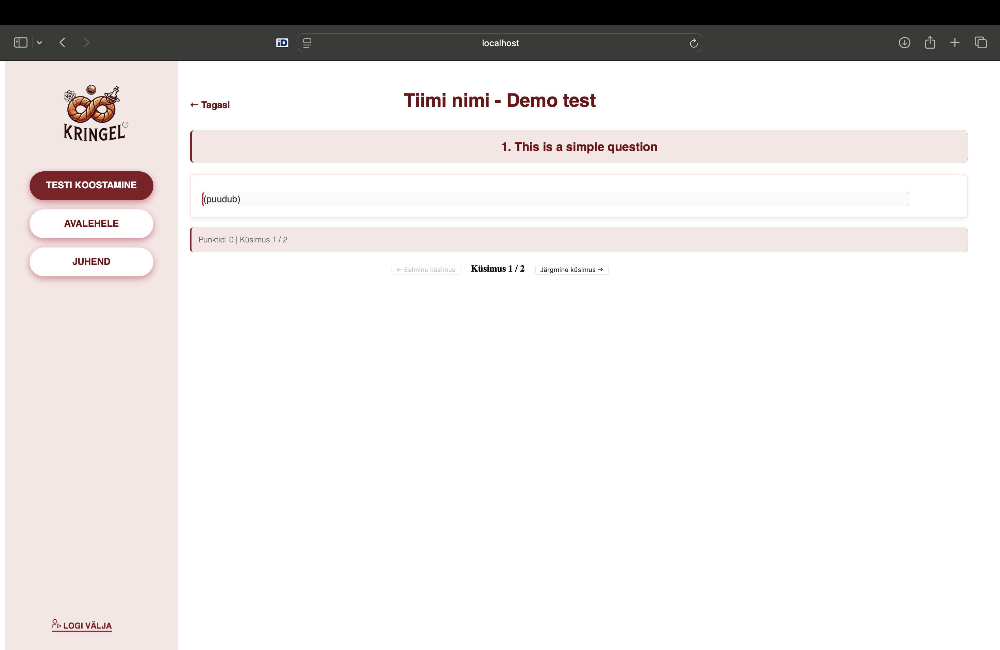
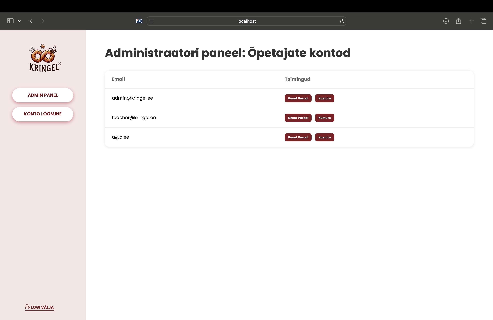
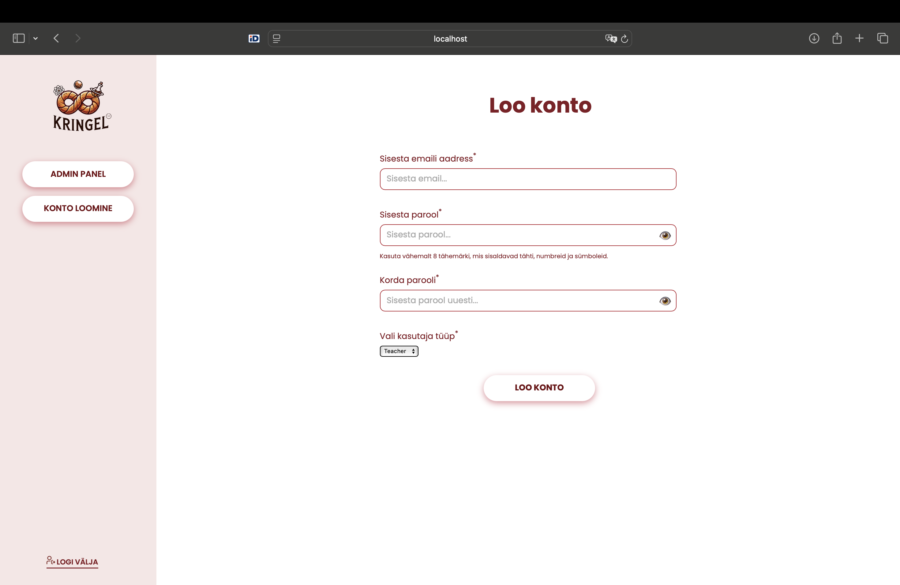

  

# KRINGEL 🥨

Oleme loomas rakendust, mis võimaldab koostada ja lahendada teste kindlate kriteeriumite alusel. Eesmärk on pakkuda paindlikku ja funktsionaalset lahendust nii õpetajatele kui ka õppijatele.
Testide sees peab olema võimalik:
- lahendada keemiaülesandeid, sh reaktsioonivõrrandite tasakaalustamine,
- visuaalselt kuvada keemilisi ahelaid,
- kasutada spetsiaalset sümbolitega klaviatuuri füüsikaülesannete lahendamiseks.

Lisaks rakenduvad testidele ajapiirangud – nii testi kättesaadavusele (millal test on nähtav) kui ka lahendamise ajale.

## Instituut
KRINGEL on Tallinna Ülikooli teadusköögi korraldatav gümnaasiumiõpilastele suunatud teadus- ja loovusvõistlus. Teadusköök tegeleb teaduse ja hariduse ühendamisega, pakkudes õpilastele praktilisi võimalusi katsetamiseks, uurimiseks ja uute lahenduste leidmiseks. 
TLÜ teadusköök korraldab õpilasvõistlust KRINGEL, mille eelvoor toimus seni Google Vormi elektroonilises keskkonnas, kuid olemasolev lahendus ei vastanud täielikult tehnilistele vajadustele. Google’i vormis saavad õpilased vajalikke vastuseid esitada, kuid see piirab teatud sisuelementide, näiteks valemite ja jooniste, lisamist. Samuti puudub ajapiiranguga vastuste esitamise võimalus.
Meie projekti eesmärk on välja töötada parem lahendus, mis võimaldab õpilastel edastada keerukamaid vastuseid, sh valemeid ja erisümboleid, ilma et peaks neid piltidena üles laadima. Lisaks peab uus lahendus toetama ajapiiranguga vastamise süsteemi, näiteks et vastuste esitamise periood kestaks ühe nädala (7 päeva novembris) ja iga osaleja saab oma vastused esitada kindla ajaraami (nt 1,5 tunni) jooksul.

## Pildid
### Õpetaja vaade
 

  
  
  
  
  
 

 
 ### Õpilase vaade

 ### Adminni vaade

  
  
 

## Kasutatud tehnoloogiad ja nende versioonid

- [Vite](https://vite.dev/) – Esipaneeli arendustööriist, mis võimaldab kiiret arendust ja optimeeritud build’e
  *Kasutatud projekti frontend’i kiireks arendamiseks ja build’imiseks.*
- [Express.js](https://expressjs.com/) – Node.js-i veebiraamistik
  *Kasutatud backend-serveri loomiseks ja API otspunktide haldamiseks.*
- [DrizzleORM](https://orm.drizzle.team/) – ORM SQL-andmebaasidele
  *Kasutatud andmemudelite defineerimiseks ja turvaliste SQL-päringute kirjutamiseks.*
- [MinIO](https://min.io/) – Objektihoidla, mis ühildub Amazon S3 API-ga
  *Kasutatud failide salvestamiseks.*
- [MySQL](https://www.mysql.com/) – Relatsiooniline andmebaasihaldussüsteem
  *Kasutatud struktureeritud andmete salvestamiseks.*
- [Zod](https://zod.dev/) – TypeScripti-sõbralik skeemi valideerimise teek
  *Kasutatud sisendi valideerimiseks (nt API päringud ja vormid), tagades andmete korrektsuse juba enne serverisse jõudmist.*

## Paigaldusjuhised arenduseks
1. Paigalda Docker (Paigaldusprotsess oleneb operatsioonisüsteemist — vt [https://docs.docker.com/get-docker/](https://docs.docker.com/get-docker/))

2. Klooni fail `.env.example` ja nimeta see ümber `.env`-iks, seejärel muuda väärtusi vastavalt vajadusele (vaikimisi väärtused on mõeldud kohaliku andmebaasi jaoks).

   2.1. Tokeni genereerimiseks käivita: `npm run token` backend kaustas. See tagastab juhuslikult genereeritud tokeni **Base64** formaadis.

3. Liigu terminalis projekti kausta ja käivita:

   3.1 Kui soovid kasutada kohalikku andmebaasi: `docker compose --profile app_dev up -w --build`

   3.2 Kui soovid kasutada välist andmebaasi: `docker compose --profile app up -w --build`

4. Dockeri peatamiseks:

   * Vajuta `Ctrl+C`
   * Seejärel käivita: `docker compose --profile (app_dev või app) down`

## Autorid 🧑‍💻
| [@triinu-klein](https://github.com/triinu-klein) | [@agetoomet](https://github.com/agetoomet) | [@coolysn](https://github.com/coolysn) | [@Merili-t](https://github.com/Merili-t) |[@HappySven06](https://github.com/HappySven06) |
|:--:|:--:|:--:|:--:|:--:|  
|  |  |  |  |  | 
| Triinu Klein | Age Toomet | Sophia Nikolajevski | Merili Tiik | Sven Laht |

